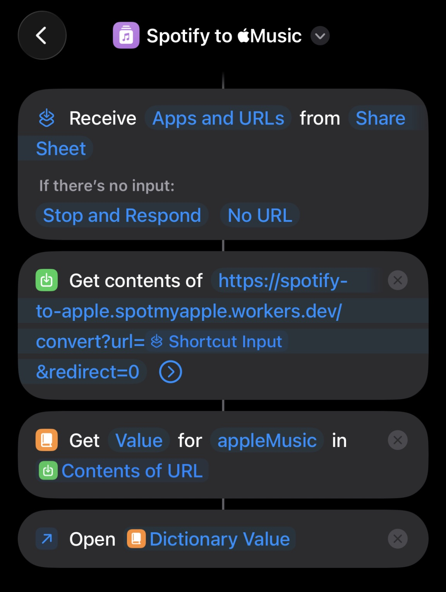

# Spotify to Apple Music [](https://workers.cloudflare.com) [](https://www.typescriptlang.org) [](#)

> your friends send you Spotify links but you're an Apple Music chad? say no more

A tiny Cloudflare Worker that converts Spotify links into Apple Music links. No API keys needed, no auth tokens, no nonsense — just paste a link and go.

## How it works

```
Spotify URL → Spotify metadata → iTunes Search → fuzzy match → Apple Music URL
                                       ↓ (miss)
                              artist catalog lookup
```

Supports **tracks**, **albums**, and **artists**. Playlists are not supported (yet? probably never, let's be honest).

## Usage

### As a redirect

Just hit the endpoint and it'll bounce you straight to Apple Music:

```
GET /convert?url=https://open.spotify.com/track/4uLU6hMCjMI75M1A2tKUQC
```

### As JSON

Pass `redirect=0` to get a JSON response instead:

```
GET /convert?url=https://open.spotify.com/track/4uLU6hMCjMI75M1A2tKUQC&redirect=0
```

```json
{
  "appleMusicUrl": "https://music.apple.com/us/album/...",
  "title": "Never Gonna Give You Up",
  "artist": "Rick Astley"
}
```

### If you really wanna step up: Apple Shortcuts

Create a shortcut with these actions:

#### Trigger: Share Sheet (filter to URLs / Spotify app)



#### Action 1: Get Contents of URL
```
URL: https://spotify-to-apple.<subdomain>.workers.dev/convert?url=[Shortcut Input]&redirect=0
Method: GET
```
#### Action 2: Get Dictionary Value → key `appleMusic` from the result
#### Action 3: Open URLs → opens the Apple Music app directly

## Development

```bash
# install dependencies
npm install

# start local dev server
npm run dev

# deploy to cloudflare
npm run deploy
```

## Tech stack

| | |
|---|---|
| **Runtime** | Cloudflare Workers |
| **Language** | TypeScript |
| **APIs** | Spotify oEmbed, iTunes Search & Lookup |
| **Dependencies** | zero. none. nada. |

## How it actually works (for the curious)

1. Takes your Spotify URL, asks Spotify's oEmbed endpoint "hey what song is this?"
2. If oEmbed doesn't return the artist (it sometimes doesn't), scrapes it from the Spotify page's meta tags
3. Cleans up the title — strips `(feat. ...)`, `[Deluxe Edition]`, `- Remastered 2024`, etc.
4. Searches iTunes with progressively looser queries until something matches
5. **Validates** results with fuzzy matching so you don't get some random song with a similar name
6. If search still fails, finds the artist on iTunes and browses their entire catalog for the track
7. Returns the match, or honestly tells you it couldn't find it instead of guessing wrong

---

<p align="center">
  <sub>built with ✨ and mild frustration at receiving spotify links</sub>
</p>
